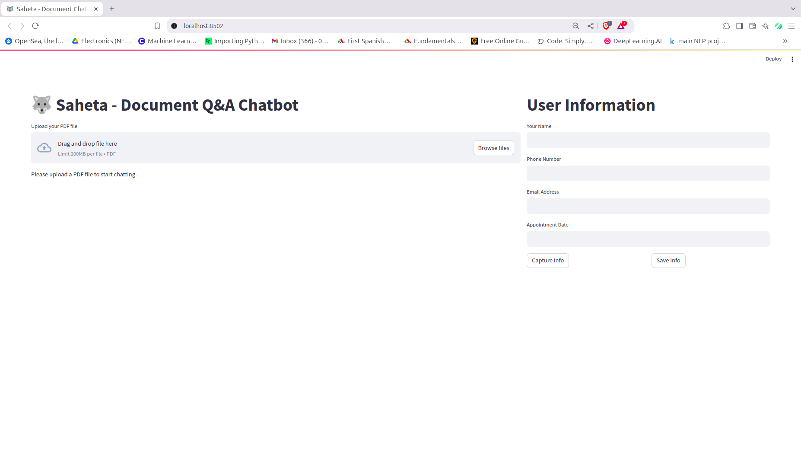
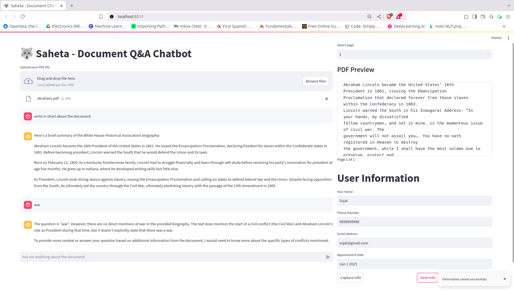
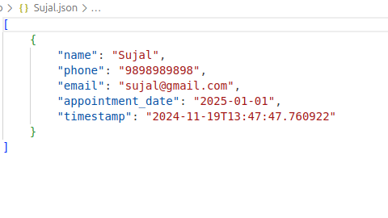

# Saheta-Chatbot 🐺

## Overview
An intelligent chatbot application that uses Retrieval-Augmented Generation (RAG) to answer questions about PDF documents. Built with Streamlit, LangChain, and Ollama, this application provides an interactive interface for document analysis and Q&A.

## Features 🌟
- **Document Processing**
  - PDF document upload and parsing
  - Real-time document preview
  - Page-by-page navigation
  
- **Intelligent Q&A**
  - RAG-based question answering
  - Context-aware responses
  - Interactive chat interface
  
- **User Management**
  - User information capture
  - Data validation
  - JSON-based storage
  
- **Modern UI**
  - Responsive two-column layout
  - Clean, intuitive interface
  - Real-time feedback

## Architecture 🏗️
- Frontend: Streamlit
- Backend: Python with LangChain
- Vector Store: FAISS
- LLM: Ollama (llama3.2:1b)
- Storage: JSON-based file system

## Prerequisites 📋
- Python 3.9+
- Conda package manager
- Ollama
- 8GB+ RAM recommended
- Internet connection for model download

## Installation 🚀

1. **Clone the repository**
```bash
git clone https://github.com/Neupanesujal/Saheta-Chatbot.git
cd Saheta-Chatbot
```

2. **Create and activate Conda environment**
```bash
conda env create -f environment.yml
conda activate doc-chatbot
```

3. **Install Ollama**
- Visit [Ollama's website]([https://ollama.ai](https://ollama.com/library/llama3.2))
- Follow installation instructions for your OS
- Pull the required model:
```bash
ollama pull llama3.2:1b
```

4. **Set up the application**
```bash
# Create necessary directories
mkdir user_info

# Install dependencies
pip install -r requirements.txt
```

5. **Start the application**
```bash
# Start Ollama server
ollama serve

# In a new terminal, start the Streamlit app
streamlit run app.py
```

## Usage 📖

1. **Upload Document**
   - Click "Upload PDF file" button
   - Select your PDF document
   - Wait for processing completion

2. **Ask Questions**
   - Type your question in the chat input
   - View responses in the chat interface
   - Navigate document preview if needed

3. **User Information**
   - Fill in user details in the sidebar
   - Click "Capture Info" to validate
   - Click "Save Info" to store data

## Project Structure 📁
```
doc-qa-chatbot/
├── app.py              # Streamlit interface
├── main.py            # Core functionality
├── requirements.txt   # Python dependencies
├── environment.yml    # Conda environment
├── user_info/        # User data storage
└── README.md         # Documentation
```

## Dependencies 📦
Key packages used:
- streamlit
- langchain
- faiss-cpu
- PyPDF2
- python-dotenv
- dateparser

Full list available in `requirements.txt`

## Contributing 🤝
1. Fork the repository
2. Create a new branch
3. Make your changes
4. Submit a pull request

## Known Issues 🐛
- Large PDF files may require significant processing time
- Memory usage can be high with multiple concurrent users
- Ollama must be running locally for the application to work

## Roadmap 🗺️
- [ ] Add support for more document formats
- [ ] Implement user authentication
- [ ] Add document summarization
- [ ] Improve response accuracy
- [ ] Add export functionality


## Acknowledgments 🙏
- LangChain team for the excellent RAG implementation
- Ollama team for the local LLM solution
- Streamlit team for the wonderful UI framework

## Contact 📧
Sujal Neupane - [@SujalNeupane](https://www.linkedin.com/in/sujal-neupane/)  
Project Link: [https://github.com/Neupanesujal/Saheta-Chatbot](https://github.com/Neupanesujal/Saheta-Chatbot)

## Screenshots 📸




---
⭐️ If you found this project helpful, please consider giving it a star on GitHub!
